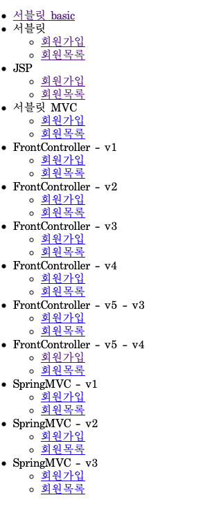
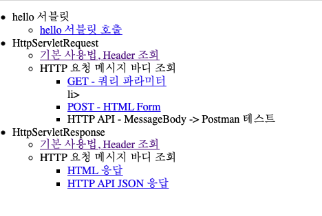
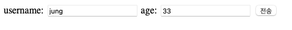
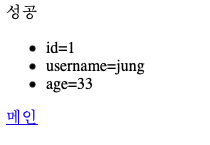
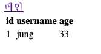

# 회원 가입 및 목록 서비스
Servlet, JSP, Servlet MVC로 구현하고 Servlet MVC의 문제점을 FrontController를 도입해 개선하면서 Spring MVC 패턴의 원리 파악 및 도입

## Description

FrontController - v1 

- HTTP 요청을 FrontController가 URL 매핑 정보에서 컨트롤러 조회
- 해당 컨트롤러를 호출하고 컨트롤러에서 JSP forward하고 JSP는 HTML응답

FrontController - v2

- V1의 모든 컨트롤러에는 뷰로 이동하는 부분에 있어서 중복이 있음
-  뷰를 처리하는 별도의 객체 생성 

FrontController - v3

- Model 추가
- 서블릿의 종속성 제거(HttpServletRequest, HttpServletResponse)

FrontController - v4 

- 구현의 입장에서 ModelView를 직접 생성 및 반환하지 않도록 인터페이스 구현

FrontController - v5 

- 핸들러 어댑터 도입하여 다양한 컨트롤러 호출
- 프레임워크를 유연하고 확장성 있도록 설계

SpringMVC - v1

- @RequestMapping 기반의 스프링 MVC 컨트롤러 변경
- ModelAndView 반환

SpringMVC - v2

- 컨트롤러 통합하여 관리

SpringMVC - v3

- Model 파라미터 도입

- @RequestParam으로 HTTP요청 파라미터 처리

- HTTP Method 구분(@GetMapping,@PostMapping)

  

## Images
    Main 화면 (index.html)

    Servlet Basic

    
    회원 가입 페이지

    회원 가입에서 등록 완료 페이지

    회원 목록 페이지

---
